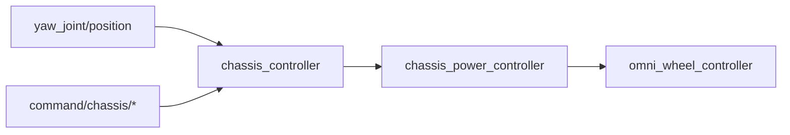
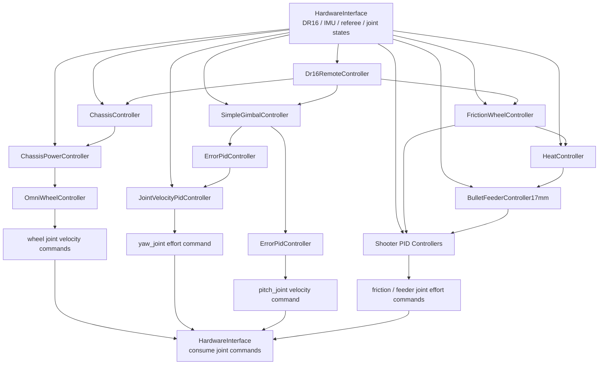

# rmgo：面向下一代无下位机机器人的 ROS2 控制系统

## 0. 前言

`rmgo` 是一个基于 ROS2 和 `ros2_control` 的 RoboMaster 无下位机控制系统实验。它希望继承 `rm_controls` 的核心精神：让上位机直接承担机器人控制闭环，通过配置和控制器组合启动完整机器人，而不是把主要控制逻辑下沉到传统意义上的下位机。

但 `rmgo` 并不打算简单复刻 `rm_controls`。ROS1 时代的 `ros_control`、TF buffer、dynamic reconfigure 和参数服务器为 RoboMaster 场景提供过非常强的工程能力，也留下了迁移、维护和实时路径上的成本。`rmgo` 的目标是在 ROS2 语境下重新组织这些能力，让控制链路更显式、更容易验证，也更适合未来接入 EtherCAT、Gazebo 和真实硬件。

可以把 `rmgo` 理解成三个判断的结合：

- 用 `ros2_control` 承担生命周期、硬件接口和 controller manager。
- 用 chainable controller 把底盘、云台、发射、PID 和功率限制拆成可组合的数据流水线。
- 用显式 state/reference interface 和 `fast_tf` 处理控制环内高频同步，把 ROS topic 和 TF 留给系统边界、调试和感知表达。

## 1. 动机

### 1.1 痛点

RoboMaster 机器人的控制系统天然跨越多个层次：

- 遥控器、键鼠、导航或策略节点产生上层命令；
- 底盘根据速度、功率限制和运动学模型输出轮组命令；
- 云台根据 yaw/pitch 编码器、IMU 和目标指令保持自稳；
- 发射机构根据摩擦轮、拨弹轮、热量限制和发射模式切换状态；
- 裁判系统、仿真系统、可视化工具又需要读写同一套状态。

`rm_control` 对这些问题给出过一套非常完整的 ROS1 解法。它不是粗暴地把所有逻辑塞进一个进程，而是把系统拆成几层：

- `rm_hw` 提供 `RobotHW` 和控制循环，稳定执行 `read -> controller_manager.update -> write`；
- `rm_controllers` 提供 chassis、gimbal、shooter 等 `ControllerInterface` 插件；
- `robot_state_controller` 维护 `RobotStateInterface`，让 controller 能在控制环里查询和写入机器人内部 TF；
- `rm_common` 提供命令发送器、功率限制、热量限制、校准队列和 controller manager helper；
- `rm_dbus`、`rm_referee`、图传和上层决策节点把外围输入转成控制器可消费的命令。

这套设计解决了当时最难的问题：如何让一台 RoboMaster 机器人只靠上位机、URDF、yaml 和 controller 插件跑起来。它的价值很大，后来的 ROS2 无下位机方案都绕不开这条路。

但站在今天回头看，`rm_control` 的解法同时暴露出一组需要被重新设计的痛点。

#### 1.1.1 All in OOP vs. Pipeline

软件工程当然推崇低耦合、高内聚的抽象，但 OOP 在机器人控制里很容易走向另一面：一个对象为了“完整负责”，把资源、状态、回调、参数、坐标变换和控制逻辑都背在身上。

`ros_control` 的 controller 语义首先是“拥有硬件资源的对象”。例如 `rm_chassis_controllers::ChassisBase`，它同时是：

- `EffortJointInterface` 和 `RobotStateInterface` 的使用者；
- `/cmd_chassis`、`cmd_vel`、`/odometry` 的订阅者；
- `RAW`、`FOLLOW`、`TWIST` 的状态机；
- 底盘 odom 的积分器和 `odom -> base_link` 的写入者；
- `base_link`、`yaw` 等 frame 之间速度转换的执行者；
- ramp filter、follow PID、功率限制和动态参数的持有者。

这非常适合资源独占和生命周期管理。然而，它不天然表达数据如何一步步变换。

> 你想要一个香蕉，结果拿到的是一只拿着香蕉的大猩猩，以及整片丛林。

底盘、云台、发射、功率限制、热量限制、遥控解释之间存在明确的数据流关系，但在 `rm_control` 中，这些关系常常藏在 controller 的成员变量、回调、参数名和 frame 名里。读代码时看到的是一个个 OOP 实体，真正想找的是一条 pipeline。

这不是 `ChassisBase` 写得差，而是抽象方向本身的副作用。controller 对象很擅长管理资源和生命周期，却很容易把“输入如何变成输出”压进对象内部。系统越大，越需要读者从对象森林里重新拼出那条数据链。

#### 1.1.2 RobotStateInterface vs. 控制热链路

`rm_control` 用 `RobotStateInterface` 包装 `tf2_ros::Buffer`，让底盘和云台在同一个控制循环中共享坐标关系。这个设计比普通跨节点通信更聪明，也让云台、底盘、目标 frame 和 odom 之间的变换变得统一。

问题在于，`tf2_ros::Buffer` 是一个通用坐标树查询系统，而不是一个专门为高频控制热链路准备的轻量数学函数。一次 `lookupTransform()` 背后包含运行时 frame 名解析、时间缓存查询、坐标树遍历、插值或外推语义、异常路径和错误信息构造。`RobotStateHandle` 把这些能力包装成了一个好用的接口，但包装并不会让这些成本消失。

控制环里的很多同步其实不需要完整 TF 能力。底盘跟随云台时，本质上需要的是 yaw 角；云台自稳时，本质上需要的是 yaw/pitch 编码器和 IMU 姿态。把这些明确状态表达成运行时 frame 查询，会把字符串约定、历史缓存和失败分支带进每一个 update 周期。

更危险的是热链路上的隐藏分配。实时控制怕的不是某次查询平均多花了几个微秒，而是最坏情况不可控：字符串、容器增长、异常对象、错误消息、缓存维护或 allocator 锁一旦在高频 update 路径上出现，抖动就会直接进入控制输出。动态分配在初始化和配置阶段可以接受，在控制热链路里则非常恐怖，因为它把“偶发但无上界”的行为带进了本该稳定的周期。

TF buffer 仍然是表达机器人坐标系、感知转换、可视化和日志的强工具。痛点不在 TF 本身，而在于把固定结构的控制同步也放进完整 TF 查询语义里。

#### 1.1.3 FuckRosLatency vs. 控制域

`rm_control` 把 DBus、裁判系统、上层决策和 controller 解耦开，这是它能被复用和调试的重要原因。但这种解耦也让“谁在同一个控制周期里生产了什么状态”变得不够直接。

遥控输入先由 `rm_dbus` 读取，再经过上层逻辑变成底盘、云台和发射命令，最后 controller 在自己的更新周期里读取缓存。这个模型能工作，也很适合 ROS1 生态；但它把人机输入、模式解释、状态新鲜度和控制链同步分散在多个边界上。

这里真正的代价不是“用了某种通信机制”这么简单，而是控制语义离开了控制域。遥控模式何时生效、底盘和云台是否消费了同一个周期的输入、某个命令超时后下游拿到什么值，这些问题需要靠缓存、回调顺序、时间戳和各 controller 自己的约定共同维持。系统能跑，但读者很难从 controller manager 的视角一眼看清数据在同一个控制周期里如何流动。

#### 1.1.4 参数即契约

`rm_control` 大量依赖 yaml、参数服务器和 dynamic reconfigure。它让调参很方便，但也让契约容易漂移：参数名、默认值、README 示例、测试 yaml 和实际代码之间很难长期保持一致。

当控制器变多、机器人形态变多，这种“靠约定记住契约”的成本会持续上升。尤其是 ROS1 参数读取往往发生在运行时字符串路径上，参数缺失、类型错误、默认值变化和文档过期不一定能在构建期或启动早期被强约束地暴露出来。

#### 1.1.5 控制基座 vs. 机器人产品

`rm_control` 和 `rm_controllers` 的包边界很强：硬件接口、公共 helper、消息、裁判、外围设备和 controller 分散在多个包中。这让它像一个通用控制基座，也让完整机器人产品的运行链路需要跨仓库、跨包、跨配置拼起来理解。

对于维护者来说，这种基座化很灵活；对于想启动一台具体机器人的开发者来说，它也会增加入口成本。机器人描述、硬件插件、controller 配置、裁判系统、遥控解释、仿真入口和真机启动方式如果没有形成一个清晰的整车视图，新人就只能沿着包名和 launch 文件一点点追。

### 1.2 前人的实践

事实上，基于 ROS2 的无下位机机器人控制系统已经有了一定的实践。它们并不是“旧方案的失败证明”，而是在不同约束下给出的不同答案。

#### 1.2.1 rm_controls

`rm_controls` 最有价值的地方不是某一个具体 controller，而是它证明了无下位机控制在 RoboMaster 场景是可行的。它通过 `RobotHW`、`controller_manager`、硬件接口、URDF 和配置文件，把整台机器人组织成一套可启动、可仿真、可调参的控制系统。

这条路留下了几件很重要的遗产：

- 机器人结构由 URDF/xacro 描述；
- 控制器通过配置文件装配；
- 硬件接口向 controller 暴露统一的 command/state interface；
- controller manager 负责生命周期和资源管理；
- 上层命令和底层硬件之间可以通过 controller 插件组合起来。

如果没有 `rm_controls` 先证明“上位机直接控制整车”这件事可行，后来的 ROS2 方案很难自然地站在这个起点上讨论架构。

#### 1.2.2 RMCS

`RMCS` 很敏锐地看到了 OOP controller 不擅长表达 pipeline 的问题。它的 Component 不再首先表达“我拥有哪个硬件资源”，而是表达“我声明哪些 input，产出哪些 output”。控制系统因此更像一张数据流图：遥控、底盘控制、功率约束、轮组控制、云台控制、PID 和硬件输出都可以沿着 input/output 的方向读下去。

更重要的是，`RMCS` 真正想吃到的是无下位机方便部署的特点。开发者可以在本地完成实现、构建和基本验证，再通过 SSH 把代码或构建产物同步到实机，在远端容器或服务里运行。这种“本地开发，远程实机同步”的工作流非常贴近比赛现场：机器在场地边，代码在开发机上，改完以后需要尽快同步到 MiniPC 并恢复运行。

也就是说，`RMCS` 的核心需求不是“接入尽可能完整的 ROS 仿真生态”，而是“让无下位机实车开发和部署足够顺手”。它没有把仿真入口设计成第一等对象，并不意味着它缺少某种必选能力，而是需求重心不同。对于已经有稳定实车硬件链路、主要工作发生在真机上的队伍来说，本地实现后远程 SSH 同步到实机，往往比维护一套完整 Gazebo 入口更直接。

还要考虑时间背景：`RMCS` 开始写的时候，`ros2_control` 的 `ChainableControllerInterface` 还没有今天这么稳定。想要清晰的数据流，就只能自己做 Component、executor 和 input/output 机制。从这个角度看，`RMCS` 不是绕开了现成答案，而是在当时的生态条件下把答案先写了出来。

#### 1.2.3 新一代 ROS2 实践

后来的 ROS2 上位机实践开始站在一个不同的生态时间点上。新的框架，例如 HKUSTGZ 的公开上位机资料，已经可以直接利用 `ros2_control` 中逐渐成熟的 Chainable Controller 思路，把 controller 串联成更明确的控制链，而不必完全自研一套调度和连接机制。

这说明问题本身没有变：大家都想让控制链像 pipeline 一样可读、可组合、可验证。变化的是可用工具变了。ROS2 早期，自己写框架是合理选择；到 Jazzy 这个阶段，`ros2_control` 已经提供了更接近这个目标的原生入口。

### 1.3 哲学总结

`rmgo` 的选择不是否定 `rm_controls`，也不是复刻 `RMCS`。更准确地说，它想继承两者各自最有价值的判断：继承 `rm_controls` 对无下位机整车控制的信心，继承 `RMCS` 对 pipeline 语义的敏感，同时把实现重新放回 ROS2 原生控制生态里。

这个取舍首先来自需求差异。`rmgo` 更在意仿真入口和真机入口共享同一套控制契约，因此需要 `description + gz_ros2_control + bringup + controller yaml` 能自然组成一个可启动的系统。为了吃到 Gazebo、URDF、controller manager、hardware interface、lifecycle 和 ROS2 工具链带来的生态收益，选择 `ros2_control` 是有意义的。

第二个原因是时机变化。现在的 `ChainableControllerInterface` 已经足够承载很多 pipeline 式控制链：上游 controller 导出 reference interface，下游 controller 把它当作 command interface 消费，硬件接口仍然由 resource manager 管理。这样既不必回到一个巨大 controller，也不必为了表达数据流完全自研 executor。

所以 `rmgo` 要革命掉的不是 ROS，也不是前人的工程实践，而是那些在今天已经不再划算的控制热链路抽象：

- 不把 controller 主要写成装满状态和回调的巨大 OOP 对象；
- 不把固定结构的高频同步压进运行时 TF buffer 查询；
- 不让控制周期内的数据新鲜度和消费顺序只靠外围缓存约定维持；
- 不让参数、frame 名和接口名长期停留在散落字符串契约里；
- 不把仿真、真机和调试入口拆成彼此难以对齐的几套边界。

换句话说，`rmgo` 想做的是一条中间路线：系统层面继续拥抱 ROS2 生态，控制链内部尽量让数据流显式、接口显式、热链路成本显式。这个哲学落到设计上，主要表现为四条原则。

#### 1.3.1 控制环内显式化

控制环内的状态同步应该尽量变成明确的接口，而不是藏在 topic 名、frame 名或 callback 顺序里。

例如底盘跟随云台，不再需要在控制环里查询任意 TF：



这种方式让依赖关系在 controller 的 `state_interface_configuration()` 和 `command_interface_configuration()` 中直接暴露出来。

#### 1.3.2 Controller 是数据变换

`rmgo` 中的 controller 更接近数据变换函数，而不是“内部什么都管”的对象。一个 controller 只回答一个问题：给定这一组 state/reference，它要产出哪一组 reference/command。

例如底盘链路可以粗略写成：

$$
\mathbf{v}_{base} = R_{yaw \to base}(\psi_{yaw}) \mathbf{v}_{cmd}, \quad
\mathbf{v}_{limited} = \mathrm{limit}_{power}(\mathbf{v}_{base}), \quad
\boldsymbol{\omega}_{wheel} = J_{omni}\mathbf{v}_{limited}
$$

这里的重点不是某个类名，而是三段变换被拆开：坐标变换、功率约束、轮组运动学。

云台链路也是同样的形状：

$$
\mathbf{e}_{gimbal} = f(q_{imu}, q_{yaw}, q_{pitch}, \dot{\mathbf{r}}_{cmd}), \quad
\tau_{yaw} = \mathrm{PID}_{vel}(\mathrm{PID}_{err}(e_{yaw}) - \dot{q}_{yaw})
$$

这种写法比“大 controller 内部调用许多子模块”更啰嗦，但它让每一段输入输出都能被 controller manager 看见，也让后面的整车章节可以按链路解释模块职责。

#### 1.3.3 仿真和真机共用接口契约

当前仓库已经实现了 Gazebo 侧的系统接口：

- `rmgo_core/CommandGzInterface`
- `rmgo_core/OmniInfantryGzInterface`

它们的任务是把 Gazebo 中的 joint、mock remote、mock IMU 和 mock referee state 暴露成与真实硬件一致的 `ros2_control` interface。未来真机接口应该暴露同样的接口集合，而不是让 controller 为仿真和真机各写一套逻辑。

#### 1.3.4 ROS 是系统边界，不是所有控制同步的默认工具

topic、TF 和 RViz 仍然重要，但它们更适合系统边界：

- topic 适合上层命令、调试数据和跨节点通信；
- TF 适合可视化、感知 frame 转换和日志表达；
- `ros2_control` interface 适合 controller 内部同步；
- `fast_tf` 适合控制环内确定结构的本地坐标变换。

这个边界让控制环更直接，也让 ROS 工具继续服务于系统观察。

## 2. 技术栈

### 2.1 ROS2 Jazzy

仓库通过 Docker 和 devcontainer 提供 ROS2 Jazzy 开发环境。工作区根目录是 `rmgo_ws`，ROS package 放在 `rmgo_ws/src` 下。

基础使用流程是：

```bash
cd /workspaces/rmgo_ws
rosdep install --from-paths src --ignore-src -r -y
colcon build
```

仓库的 Docker 入口会自动 source ROS2 环境；工作区构建过之后，也会自动 source `rmgo_ws/install/setup.bash`。

### 2.2 ros2_control

`rmgo` 的核心运行时建立在 `ros2_control` 上：

- 硬件或仿真系统通过 `hardware_interface` 暴露 command/state interface；
- controller 通过 `controller_interface` 声明自己读写哪些接口；
- `controller_manager` 负责 controller 的加载、配置、激活和更新；
- chainable controller 使用 reference interface 串联上下游。

这让 `rmgo` 不需要自己维护一个 executor，也能获得明确的控制生命周期。

### 2.3 Chainable Controller

`ChainableControllerInterface` 是 `rmgo` 控制链的关键。它允许一个 controller 导出 reference interface，供下游 controller 当作 command interface 使用。

以底盘链路为例：

```text
ChassisController
  -> chassis_power_controller/linear/x/velocity
  -> chassis_power_controller/linear/y/velocity
  -> chassis_power_controller/angular/z/velocity

ChassisPowerController
  -> omni_wheel_controller/linear/x/velocity
  -> omni_wheel_controller/linear/y/velocity
  -> omni_wheel_controller/angular/z/velocity

OmniWheelController
  -> left_front_wheel_joint/velocity
  -> left_back_wheel_joint/velocity
  -> right_back_wheel_joint/velocity
  -> right_front_wheel_joint/velocity
```

上游不需要知道下游如何实现，只需要写入约定好的 reference interface。

### 2.4 generate_parameter_library

`rmgo_core` 使用 `generate_parameter_library` 为 controller 参数生成类型化访问代码。每个 controller 的参数定义放在 `config/controller/.../*.yaml` 中。

这样做的好处是：

- 参数名和类型集中声明；
- 启动时能获得更明确的参数校验；
- controller 代码不需要到处写字符串读取参数；
- 配置文件和代码之间更容易保持一致。

### 2.5 FastTF

`fast_tf` 是仓库内的轻量类型化 TF 工具。它不是为了替代 ROS TF，而是为了让控制环内的固定机器人结构变换更轻。

它使用编译期 link graph 表达机器人内部结构，例如：

```text
BaseLink -> YawLink -> PitchLink -> CameraLink
BaseLink -> YawLink -> PitchLink -> ImuLink
BaseLink -> LeftFrontWheelLink
```

运行时只更新 yaw、pitch、IMU quaternion 等少量状态，然后使用 Eigen 完成本地变换。它没有字符串 frame 查找，没有历史缓存，也没有跨节点语义。

### 2.6 Gazebo 与 gz_ros2_control

当前可运行路径主要面向 Gazebo：

- xacro 中挂载 `libgz_ros2_control-system.so`；
- `OmniInfantryGzInterface` 暴露整车 joint、IMU、裁判和遥控状态；
- `CommandGzInterface` 提供上层命令 bus 的 loopback；
- `bringup.launch.py` 负责加载模型、启动 Gazebo、桥接 `/clock` 和 odometry，并自动 spawn controller。

这让 `rmgo` 能先在仿真里验证 controller chain，再逐步替换真实硬件接口。

## 3. 项目结构

### 3.1 顶层目录

```text
rmgo
├── docker/                 # ROS2 Jazzy 开发镜像入口
├── docs/                   # 设计文档和专题文档
├── rmgo_ws/                # ROS2 workspace
│   └── src/
│       ├── fast_tf/
│       ├── rmgo_bringup/
│       ├── rmgo_core/
│       ├── rmgo_description/
│       └── rmgo_utility/
└── README.md
```

### 3.2 fast_tf

`fast_tf` 提供类型化 link、joint、joint collection 和坐标变换工具。它关注的是控制环内固定结构的快速变换，而不是动态 ROS TF 网络。

核心文件包括：

- `include/fast_tf/fast_tf.hpp`
- `include/fast_tf/impl/link.hpp`
- `include/fast_tf/impl/joint.hpp`
- `include/fast_tf/impl/joint_collection.hpp`
- `include/fast_tf/impl/cast.hpp`

### 3.3 rmgo_description

`rmgo_description` 描述机器人结构和可视化资产。当前主要包含 Omni Infantry：

- `urdf/omni_infantry.urdf.xacro`
- `urdf/omni_infantry_gz.urdf.xacro`
- `include/rmgo_description/tf_description.hpp`
- `meshes/visual/*.stl`
- `launch/display.launch.py`

其中 `tf_description.hpp` 同时为 `fast_tf` 定义了 `BaseLink`、`YawLink`、`PitchLink`、`CameraLink`、`MuzzleLink`、各轮 link 等类型化坐标节点。

### 3.4 rmgo_utility

`rmgo_utility` 存放 controller 编写时复用的 mixin。

`ControllerInterfaceMixin` 主要解决这些重复代码：

- 参数初始化和更新；
- command/state interface 配置构造；
- interface index 绑定；
- 安全读写 command interface；
- reference interface 创建；
- NaN 和无效值兜底。

`NodeMixin` 则为 controller 提供更统一的日志和 node 访问方式。

### 3.5 rmgo_core

`rmgo_core` 是控制系统主体，包含 controller、硬件接口、参数定义和 plugin 描述。

当前 controller 插件包括：

- `rmgo_core/ChassisController`
- `rmgo_core/ChassisPowerController`
- `rmgo_core/OmniWheelController`
- `rmgo_core/TeleopRemoteController`
- `rmgo_core/SimpleGimbalController`
- `rmgo_core/ErrorPidController`
- `rmgo_core/JointVelocityPidController`
- `rmgo_core/FrictionWheelController`
- `rmgo_core/HeatController`
- `rmgo_core/BulletFeederController17mm`

当前 Gazebo 硬件插件包括：

- `rmgo_core/CommandGzInterface`
- `rmgo_core/OmniInfantryGzInterface`

### 3.6 rmgo_bringup

`rmgo_bringup` 负责启动整车。

主要文件：

- `launch/bringup.launch.py`
- `config/omni_infantry.yaml`
- `config/omni_infantry_gz.yaml`

`bringup.launch.py` 会根据 `robot` 参数找到对应配置文件，根据 `model` 参数选择 xacro 模型，并自动从配置文件中读取 controller 名称进行加载。

## 4. 如何搭建一个 Omni Infantry

这一节从整车控制链开始看 Omni Infantry。先看全景图，再沿着 Command Bus、底盘、云台、发射和 PID 链路读下去，最后回到模型、配置和启动流程。

### 4.1 全景图

以真机视角看，Omni Infantry 的控制链可以概括为：



### 4.2 Command Bus

真机视角下，`Dr16RemoteController` 是控制链入口。它读取 `HardwareInterface` 暴露的 DR16、键鼠和模式开关状态，把人的输入解释成统一的 command bus。仿真和调试时，`TeleopRemoteController` 可以作为替代入口，订阅上层 topic：

- `/cmd_vel`
- `/cmd_gimbal`
- `/cmd_chassis_mode`
- `/cmd_shooter_mode`

两种入口最终写入同一组 command bus interface：

```text
command/chassis/linear/x/velocity
command/chassis/linear/y/velocity
command/chassis/angular/z/velocity
command/chassis/mode
command/gimbal/yaw/velocity
command/gimbal/pitch/velocity
command/gimbal/enabled
command/shooter/mode
command/shooter/sequence
```

这些 interface 在仿真中由 `CommandGzInterface` loopback 成 state interface，供下游 controller 读取。真机实现则应由 `HardwareInterface` 暴露真实遥控、IMU、裁判和 joint state，并消费最终 joint command。

从数据变换角度看，入口 controller 做的是：

$$
(u_{remote}, s_{mode}) \mapsto
\{\mathbf{v}_{chassis}^{cmd}, \dot{\mathbf{r}}_{gimbal}^{cmd}, m_{shooter}\}
$$

也就是把遥控器和模式开关解释成底盘速度、云台速度和发射状态，而不是直接碰底层 joint。

### 4.3 底盘链路

底盘链路由三层组成。

第一层是 `ChassisController`。它读取上层命令和 yaw joint position，处理三种模式：

- `raw`：直接使用输入速度；
- `follow`：根据 yaw 角闭环，让底盘跟随云台；
- `twist`：在候选偏置角附近生成小陀螺角速度。

如果 `command_source_frame` 是 `yaw`，它还会把输入的平移速度从云台方向旋转到 `base_link`。

第二层是 `ChassisPowerController`。它根据裁判系统功率状态、缓冲能量和速度限制缩放底盘命令，避免下游轮组命令超过配置的功率边界。

第三层是 `OmniWheelController`。它使用全向轮运动学矩阵，把 `base_link` 坐标系下的 `vx`、`vy`、`wz` 转成四个轮子的速度命令。

这条链路可以概括为：

$$
\mathbf{v}_{base} =
R_{yaw \to base}(\psi_{yaw})\mathbf{v}_{cmd}
$$

$$
\mathbf{v}_{limited} = \alpha(P_{referee}, E_{buffer})\mathbf{v}_{base}, \quad
0 \le \alpha \le 1
$$

$$
\boldsymbol{\omega}_{wheel} = J_{omni}\mathbf{v}_{limited}
$$

也就是：先把命令速度放进底盘坐标系，再根据功率状态缩放，最后用全向轮雅可比矩阵生成四个轮子的目标速度。

### 4.4 云台链路

云台链路从 `SimpleGimbalController` 开始。它读取：

- yaw joint position；
- pitch joint position；
- gimbal IMU quaternion；
- `command/gimbal/yaw/velocity`；
- `command/gimbal/pitch/velocity`；
- `command/gimbal/enabled`。

每个控制周期，它会更新本地 `fast_tf`，再由 two-axis gimbal solver 计算 yaw/pitch angle error。

之后：

- yaw angle error 交给 `ErrorPidController`；
- yaw velocity target 交给 `JointVelocityPidController`；
- 最终输出 yaw joint effort；
- pitch angle error 交给 `ErrorPidController`；
- 当前配置中 pitch 下游直接写 pitch joint velocity。

这条链路的核心是：云台自稳依赖显式 joint/IMU state，而不是在控制环内查询共享 TF buffer。

从数据流上看，云台 controller 先把姿态状态和输入速度变成角度误差：

$$
(e_{yaw}, e_{pitch}) =
g(q_{imu}, q_{yaw}, q_{pitch}, \dot{\mathbf{r}}_{cmd})
$$

然后由通用 PID controller 接住这个误差：

$$
\dot{q}_{yaw}^{target} = \mathrm{PID}_{err}(e_{yaw}), \quad
\tau_{yaw} = \mathrm{PID}_{vel}(\dot{q}_{yaw}^{target} - \dot{q}_{yaw})
$$

$$
\dot{q}_{pitch}^{target} = \mathrm{PID}_{err}(e_{pitch})
$$

因此 `SimpleGimbalController` 不需要自己拥有所有 PID 细节，它只负责把机器人姿态问题变成下游 controller 能消费的误差信号。

### 4.5 发射链路

发射链路由摩擦轮、热量控制和拨弹控制组成。

`FrictionWheelController` 负责：

- 根据 shooter mode 控制左右摩擦轮目标速度；
- 判断摩擦轮是否 ready；
- 向热量控制和拨弹控制传递允许发射的状态。

`HeatController` 负责：

- 根据裁判系统热量、冷却和保留热量计算是否允许发射；
- 把热量约束传递给拨弹链路。

`BulletFeederController17mm` 负责：

- 单发、连发和反卡弹模式；
- 根据 `bullets_per_feeder_turn` 和发射频率生成拨弹轮目标速度；
- 把目标速度交给拨弹轮 PID controller。

这条链路的核心数据关系是：

$$
\omega_{friction}^{target} = h_f(m_{shooter})
$$

$$
a_{heat} =
\begin{cases}
1, & H + \Delta H \le H_{limit} - H_{reserve} \\
0, & \text{otherwise}
\end{cases}
$$

$$
\omega_{feeder}^{target} =
a_{friction}a_{heat}\frac{2\pi f_{shoot}}{N_{bullet/turn}}
$$

摩擦轮决定“能不能稳定出弹”，热量链路决定“裁判系统是否允许出弹”，拨弹链路再把发射频率换成拨弹轮速度。

### 4.6 PID 链路

`rmgo` 将 PID 抽成通用 controller，而不是让每个机构 controller 内部各自维护一套 PID 代码。

当前有两类 PID：

- `ErrorPidController`：从误差生成下游控制量；
- `JointVelocityPidController`：从目标速度和实际速度生成 joint command。

这让云台、发射和未来更多机构都能复用同一套 PID 结构。

抽象出来以后，机构 controller 输出的是误差或目标值，PID controller 负责统一的控制律：

$$
u(t) = K_p e(t) + K_i \int e(t)dt + K_d \dot{e}(t)
$$

这让“机构逻辑”和“控制律”分开，也让 PID 参数可以在配置里统一表达。

### 4.7 机器人模型

当前示例机器人是 Omni Infantry。它包含：

- 四个全向轮 joint；
- yaw/pitch 两轴云台；
- 左右摩擦轮；
- 拨弹轮；
- IMU、muzzle、camera 等辅助 link；
- Gazebo 侧更细的全向轮滚子模型。

基础模型在 `omni_infantry.urdf.xacro`，Gazebo 细化模型在 `omni_infantry_gz.urdf.xacro`。

### 4.8 配置文件

`rmgo_bringup/config/omni_infantry.yaml` 和 `omni_infantry_gz.yaml` 描述当前控制器组合。

配置文件主要包含：

- controller manager 更新频率；
- controller 类型声明；
- 每个 controller 的参数；
- 各 controller 之间的 target controller 名称；
- joint 名、state interface 名和 command interface 名；
- PID 参数、速度限制、功率限制、发射参数。

### 4.9 启动流程

典型启动流程如下：

```bash
ros2 launch rmgo_bringup bringup.launch.py robot:=omni_infantry_gz
```

launch 文件会完成这些事情：

1. 读取 `robot` 和 `model` 参数；
2. 找到对应的 xacro 和 controller yaml；
3. 启动 Gazebo；
4. 启动 `robot_state_publisher`；
5. 通过 `ros_gz_bridge` 桥接 `/clock` 和 odometry；
6. 创建机器人模型；
7. 根据 yaml 中的 controller 列表自动 spawn controller。

如果只是看模型，可以使用：

```bash
ros2 launch rmgo_description display.launch.py
```

## 5. 如何搭建一个新的机器人

### 5.1 描述机器人结构

第一步是写 `rmgo_description` 中的 xacro：

- 定义 link 和 joint；
- 为每个受控 joint 声明 command/state interface；
- 为仿真或真机选择硬件 plugin；
- 如有必要，在 `tf_description.hpp` 中补充 `fast_tf` link 和 joint。

### 5.2 定义硬件接口

仿真接口和真机接口应该暴露同样的 controller-facing contract。

仿真侧可以参考：

- `CommandGzInterface`
- `OmniInfantryGzInterface`

真机侧未来应在同一边界上接入 EtherCAT、CAN、UART 或其他总线。理想路径是每个控制周期采样一次硬件状态，然后把结果写入 `ros2_control` state interface；控制器输出则通过 command interface 汇总到硬件写入阶段。

### 5.3 编写 controller

新增 controller 时优先回答三个问题：

1. 它读取哪些 state interface？
2. 它写入哪些 command 或 reference interface？
3. 它是否应该是 chainable controller？

如果 controller 只是把上游 reference 变换成下游 reference，通常应该实现为 `ChainableControllerInterface`。如果它需要订阅上层 topic 或作为控制链入口，通常可以实现为普通 `ControllerInterface`。

### 5.4 写参数定义

参数定义应该放到 `rmgo_core/config/controller/...` 下，并通过 `generate_parameter_library` 生成类型化参数。

不要在 controller 中散落字符串参数读取。这样做短期更快，长期会让配置漂移重新出现。

### 5.5 装配 bringup 配置

最后在 `rmgo_bringup/config/<robot>.yaml` 中装配 controller：

- 在 `controller_manager.ros__parameters` 下声明 controller 类型；
- 为每个 controller 填写 target controller、joint 名、interface 名；
- 让上游和下游 interface 名保持一致；
- 用同一份配置驱动 xacro 中的 `gz_ros2_control`。

## 6. 当前状态

### 6.1 已经具备的能力

当前 `rmgo` 已经具备：

- ROS2 Jazzy Docker/devcontainer 开发环境；
- Omni Infantry xacro 模型；
- Gazebo 侧整车控制接口；
- controller plugin 注册；
- 底盘、云台、发射、PID、功率控制的初版 controller；
- command bus 入口；
- `fast_tf` 类型化坐标树；
- 自动读取 yaml 并 spawn controller 的 bringup。

### 6.2 仍在演进的部分

当前仍需要继续完善：

- 真机硬件接口；
- EtherCAT、CAN、UART 等传输层适配；
- 裁判系统真实协议接入；
- 更完整的导航、视觉和弹道链路；
- controller 单元测试和仿真回归测试；
- 更严格的实时性评估；
- 更清晰的调试和 telemetry 输出。

这些缺口并不改变 `rmgo` 的核心方向：先把 controller-facing interface 稳住，再逐步替换底层硬件实现和上层应用。

## 7. 与已有文档的关系

`docs/chase_the_next_era.md` 更像一篇设计动机草稿，记录 `rmgo` 为什么要尝试跟上 ROS2 和下一代控制系统的方向。

`docs/gimbal_chassis_sync_next_era.md` 聚焦一个具体问题：云台和底盘同步应该用 topic、TF buffer，还是显式控制链接口。

本文档则是项目总览。它不替代前两篇，而是给读者一个从仓库结构到控制链路的完整入口。

## 8. 小结

`rmgo` 不是单纯的 ROS2 移植，也不是对 `RMCS` 的复刻。它尝试把 `rm_controls` 的无下位机精神放进 ROS2 原生控制生态里：让硬件接口、controller lifecycle、参数、仿真和控制链路都围绕 `ros2_control` 展开。

它的核心取舍是清楚的：

- 控制环内使用显式 interface；
- 复杂机构拆成 chainable controller；
- 本地高频坐标变换使用 `fast_tf`；
- ROS topic 和 TF 继续承担系统边界与调试表达；
- 仿真和真机共享同一套 controller-facing contract。

如果这套边界能稳定下来，`rmgo` 就能在不牺牲 ROS2 工具链的前提下，让 RoboMaster 无下位机控制系统变得更轻、更明确，也更容易继续长大。
